# Informe — Instalación y configuración SIEM (ELK) + Agente (nginx-filebeat)
**Actividad:** 2.b.02 — Implementación y Configuración de SIEM  
**Objetivo:** Instalar y configurar un SIEM (ELK) y un agente (nginx+Filebeat) para recolectar logs y visualizarlos en Kibana, dejando el sistema listo para implementar el caso de uso (fuerza bruta).  

---

## 1. Escenario y arquitectura
Se desplegaron **dos contenedores Docker** conectados a una **red bridge** dedicada:

- **Contenedor SOC (SIEM):** `sebp/elk:7.16.3`  
  Servicios:
  - Kibana `5601`
  - Elasticsearch `9200`
  - Logstash (Beats input) `5044` 

- **Contenedor Endpoint/Agente:** `nginx-filebeat` (nginx + Filebeat)  
  - Nginx `8080`
  - Filebeat envía logs a Logstash (5044)

**Red Docker:** `elk-red` (subnet `172.20.0.0/24`)  
**IP fija ELK:** `172.20.0.10`

---

## 2. Instalación del SIEM (contenedor ELK)

### 2.1 Crear red Docker dedicada
```bash
docker network create -d bridge --subnet 172.20.0.0/24 elk-red
```
### 2.2 Descarga de la imagen
Se utiliza la versión **7.16.3** para asegurar compatibilidad con el agente.
```bash
docker pull sebp/elk:7.16.3
```

### 2.3 Ejecución del contenedor
El contenedor se despliega en una red dedicada (`elk-red`) con una dirección IP estática para evitar fallos de resolución entre servicios.
```bash
docker run -p 5601:5601 -p 9200:9200 -p 5044:5044 \
  -it --name elk --net elk-red --ip 172.20.0.10 -d sebp/elk:7.16.3
```

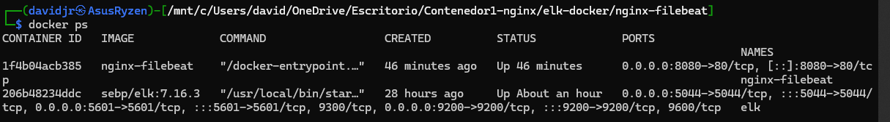

### 2.4 Verificaciones iniciales
* **Kibana:** `curl -i http://localhost:5601/` (Verifica acceso al portal).

* **Elasticsearch:** `curl -s http://localhost:9200/` (Verifica que el motor de búsqueda esté activo).

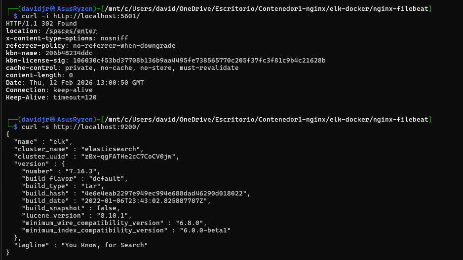

---

## 3. Configuración del Agente (nginx-filebeat)

### 3.1 Alineación de versiones
Tras pruebas iniciales con versiones 8.x que presentaron conflictos de TLS, se decidió **estabilizar el sistema en la versión 7.16.3**, alineando el agente con el servidor.

### 3.2 Construcción y arranque
Desde el directorio del proyecto `nginx-filebeat/`:
```bash
# Construir imagen personalizada
docker build -t nginx-filebeat .

# Arrancar el agente
docker run -d --name filebeat --net elk-red -p 8080:80 nginx-filebeat
```

### 3.3 Configuración de `filebeat.yml`
El agente está configurado para recolectar logs de Nginx y enviarlos a través de **Logstash** sin cifrado TLS (fase PoC):

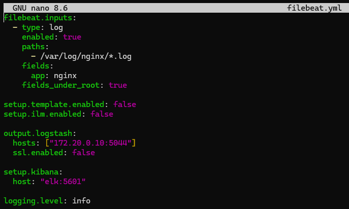
---

## 4. Validación de la Ingesta

### 4.1 Test de salida
Para confirmar que el agente "ve" al servidor ELK:
```bash
filebeat test output -e
```

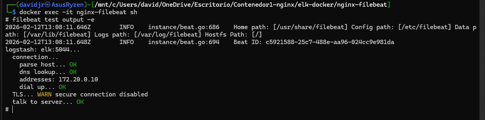

Y también observamos si su configuración es correcta:
```bash
filebeat test config -e
```

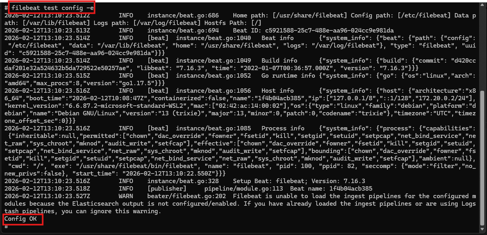

### 4.2 Índices en Elasticsearch
Verificación de la creación automática de índices diarios:
```bash
curl -s http://localhost:9200/_cat/indices?v
```
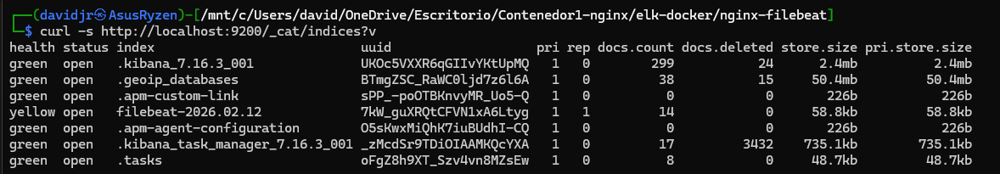
---

## Errores encontrados y solución (TLS / compatibilidad de versiones)

### Problema: fallos TLS (bad_certificate / cert expirado / handshake)
**Síntomas**
- En Logstash aparecían errores de handshake TLS (`bad_certificate`) y el envío de Filebeat no se completaba.
- En `filebeat test output -e` llegamos a ver errores tipo `x509: certificate has expired or is not yet valid` cuando Filebeat intentaba negociar TLS.

**Causa raíz**
- Estábamos probando inicialmente con el contenedor `nginx-filebeat` usando **Filebeat 8.14.3** mientras el SIEM estaba en **ELK 7.16.3** (incompatibilidad de stack / configuración y además problemas de certificados).  
- La documentación de Elastic para asegurar Filebeat↔Logstash con TLS requiere una configuración coherente de certificados/CA y, si se fuerza verificación o mTLS, cualquier discrepancia rompe la conexión.

**Solución aplicada (definitiva)**
1. **Alineamos versiones**: cambiamos `nginx-filebeat` (Filebeat) a **7.16.3**, igual que ELK `7.16.3`.  
2. **Simplificamos el transporte**: deshabilitamos SSL en el envío a Logstash (`ssl.enabled: false`) para evitar el bloqueo por certificados durante la PoC.
3. **Actualizamos la sintaxis del filebeat.yml** al formato correcto para 7.16.3: `filebeat.inputs` y `output.logstash`.

### Configuración final aplicada en `filebeat.yml`
```yaml
filebeat.inputs:
  - type: log
    enabled: true
    paths:
      - /var/log/nginx/*.log
    fields:
      app: nginx
    fields_under_root: true

setup.template.enabled: false
setup.ilm.enabled: false

output.logstash:
  hosts: ["172.20.0.10:5044"]
  ssl.enabled: false

setup.kibana:
  host: "elk:5601"

logging.level: info
```

## 5. Visualización en Kibana

Para visualizar los datos, se deben seguir estos pasos en la interfaz web (`http://localhost:5601`):

1. Entrar en Kibana: `http://localhost:5601`.
2. Ir a **Stack Management**.
3. Entrar en **Index Patterns**.
4. Crear un patrón nuevo:
   - **Index pattern**: `filebeat-*`
   - **Time field**: `@timestamp` (si existe en los documentos).
5. Ir a **Discover** y seleccionar ese Index Pattern para explorar los logs.

- Imagen Adjunta sobre la creación del Patrón:

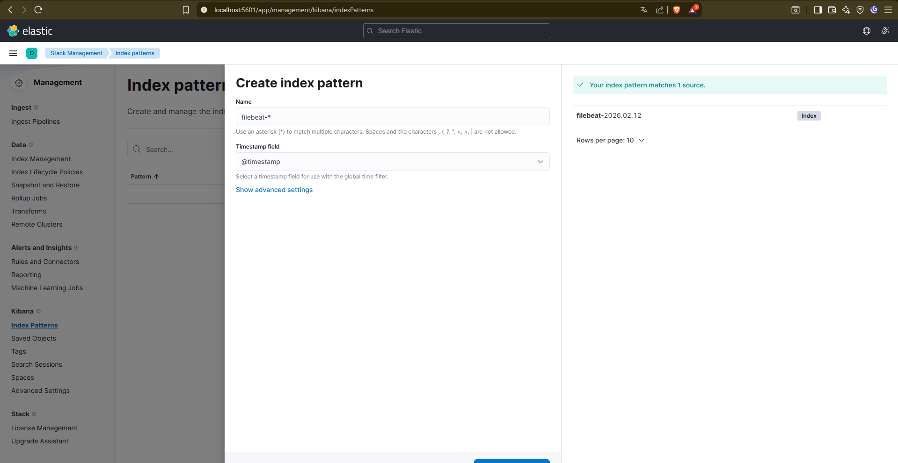

- Imagen Adjunta sobre la visualización de Logs en Discover:

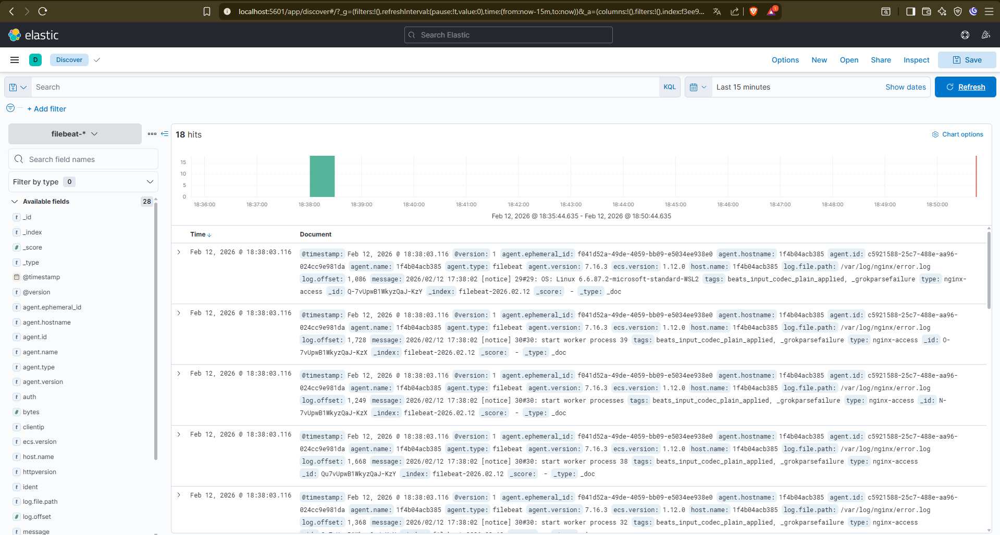

### Problema: Kibana no mostraba eventos nuevos (ingesta detenida)
**Síntomas**
- En Kibana (Discover) no aparecían logs nuevos aunque se pulsara **Refresh**.
- En el servidor se comprobó que Nginx **sí estaba generando entradas** en el fichero:
  - `tail -f /var/log/nginx/access.log` mostraba nuevas líneas al lanzar peticiones con `curl` (p. ej. `curl http://localhost:8080/`).
- Aun así, esos eventos no llegaban al índice `filebeat-*` y por tanto no se visualizaban.

**Causa raíz**
- El servicio de Filebeat estaba detenido:
  - `systemctl status filebeat` mostraba `Active: inactive (dead)`.
- Al no estar Filebeat ejecutándose, no se enviaban eventos a Logstash/Elasticsearch, por lo que Kibana no podía mostrar logs nuevos.

**Solución aplicada**
1. Se arrancó Filebeat:
```bash
  systemctl start filebeat
  systemctl status filebeat --no-pager
```
---

# 6. Instalación de Snort 2.9.20 (IDS)

## 6.1 Objetivo

Instalar Snort 2.9.20 desde código fuente en el contenedor para poder detectar tráfico mediante reglas (p. ej. `local.rules`) y generar alertas.

## 6.2 Requisitos previos (paquetes base)

Antes de compilar, se instalaron herramientas de compilación y dependencias comunes:
```bash
apt-get update
apt-get install -y build-essential bison flex libpcap-dev zlib1g-dev \
  libdumbnet-dev pkg-config
```

*(El resto de dependencias se fueron añadiendo según errores de `configure`/`make`).*

## 6.3 Descarga del código fuente (DAQ + Snort)

Se descargaron y descomprimieron DAQ 2.0.7 y Snort 2.9.20:
```bash
cd /opt/snort_src
wget https://www.snort.org/downloads/snort/daq-2.0.7.tar.gz
wget https://www.snort.org/downloads/snort/snort-2.9.20.tar.gz
tar -xzf daq-2.0.7.tar.gz
tar -xzf snort-2.9.20.tar.gz
```

## 6.4 Compilación e instalación de DAQ
```bash
cd /opt/snort_src/daq-2.0.7
./configure
make
make install
ldconfig
```

DAQ es la librería de adquisición de paquetes usada por Snort 2.9.x.

## 6.5 Compilación e instalación de Snort 2.9.20
```bash
cd /opt/snort_src/snort-2.9.20
./configure --enable-sourcefire --disable-open-appid
make
make install
ldconfig
```

El flag `--enable-sourcefire` es el recomendado en el instalador oficial de Snort 2.9.20, y `--disable-open-appid` se aplicó para evitar dependencias extra (LuaJIT) durante la PoC.

## 6.6 Verificación de instalación
```bash
snort -V
which snort
```

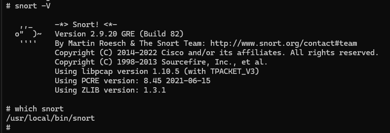

## 6.7 Errores encontrados y solución

### Error 1: `ERROR! Libpcre header not found` + `pcre-config: command not found`

**Síntomas:**

En `./configure` aparecía:
```
pcre-config: command not found
checking for pcre.h... no
ERROR! Libpcre header not found.
```

**Causa raíz:**

El `configure` intentaba localizar PCRE mediante `pcre-config`, pero no estaba disponible en el sistema/PATH y Debian 13 no ofrece `libpcre3-dev` como candidato instalable.

**Solución aplicada:**

Se compiló e instaló PCRE 8.45 desde fuente en `/usr/local/pcre` y se comprobó:
```bash
/usr/local/pcre/bin/pcre-config --version  # 8.45
```

Se expuso `pcre-config` al sistema y se forzaron rutas de include/lib para que `configure` encontrase `pcre.h`:
```bash
export PATH="/usr/local/pcre/bin:$PATH"
export CPPFLAGS="-I/usr/local/pcre/include"
export LDFLAGS="-L/usr/local/pcre/lib"
```

---

### Error 2: `ERROR! LuaJIT library not found` (OpenAppID)

**Síntomas:**

Durante `./configure`:
```
checking for luajit... no
ERROR! LuaJIT library not found ...
```

**Causa raíz:**

Se estaba intentando compilar con soporte de OpenAppID, que requiere LuaJIT.

**Solución aplicada:**

Se recompiló desactivando OpenAppID, tal como sugiere el propio error:
```bash
./configure --enable-sourcefire --disable-open-appid
```

---

### Error 3: `fatal error: rpc/rpc.h: No such file or directory`

**Síntomas:**

En `make` falló el plugin `sp_rpc_check.c`:
```
fatal error: rpc/rpc.h: No such file or directory
```

**Causa raíz:**

En sistemas modernos el RPC clásico no está disponible como antes; hay que usar los headers de TIRPC.

**Solución aplicada:**

Se instaló la dependencia:
```bash
apt-get install -y libtirpc-dev
```

Se recompiló forzando el include de TIRPC y el enlace con `tirpc`:
```bash
export CPPFLAGS="-I/usr/include/tirpc ${CPPFLAGS:-}"
export LIBS="-ltirpc ${LIBS:-}"
```

## Problemas durante la configuración de Snort (snort.conf) y solución

Durante la validación de la configuración con:
```bash
snort -T -c /etc/snort/snort.conf
```

Snort fue devolviendo varios errores encadenados debido a que el `snort.conf` copiado era un fichero genérico y nuestro despliegue (instalación desde código fuente + PoC sin ruleset completo + OpenAppID deshabilitado) no tenía todavía todas las rutas/archivos esperados.

---

### 1) `snort.conf` no existía en `/etc/snort`

**Síntoma:**

- Error inicial: `Unable to open rules file "/etc/snort/snort.conf": No such file or directory`.

**Causa:**

- Al instalar Snort desde código fuente, el binario queda instalado, pero el fichero `snort.conf` no aparece automáticamente en `/etc/snort` si no se copia manualmente desde el directorio `etc/` del tarball.

**Solución aplicada:**

- Se copiaron los ficheros de configuración (`*.conf` y `*.map`) desde `snort-2.9.20/etc/` a `/etc/snort/`:
```bash
cp /opt/snort_src/snort-2.9.20/etc/*.conf /etc/snort/
cp /opt/snort_src/snort-2.9.20/etc/*.map /etc/snort/
```

## Verificación de Snort (IDS) en modo consola

### 1) Preparación: reglas locales (`local.rules`)

Para validar que Snort detecta tráfico real, se editó el fichero de reglas locales:

- Ruta: `/etc/snort/rules/local.rules`

Se añadieron/ajustaron estas reglas (según la captura):
```bash
# Regla para detectar un ping (ICMP)
alert icmp any any -> $HOME_NET any (msg:"!Trafico ICMP!"; sid:3000001;)

# Regla para detectar SSH (con limitación de eventos)
alert tcp any any -> any 22 (msg:"Acceso SSH"; sid:3000002; flow:established; threshold: type limit, track by_src, count 1, seconds 30;)
```

- La primera regla genera una alerta cuando Snort observa paquetes ICMP hacia `$HOME_NET` (útil como prueba rápida con `ping`).
- La segunda regla alerta conexiones TCP hacia el puerto 22 (SSH) y aplica `threshold` para limitar alertas repetidas desde el mismo origen (1 alerta cada 30s por IP origen).

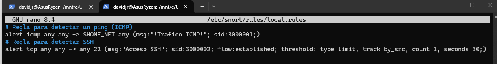


### 2) Ejecución de Snort en modo IDS (alertas por consola)

Se lanzó Snort en modo detección con alertas en consola usando:
```bash
snort -A console -q -c /etc/snort/snort.conf -i eth0
```

Donde:

- `-A console` imprime las alertas en la salida estándar (con formato tipo "fast alerts" en consola).
- `-q` ejecuta en modo "quiet", reduciendo mensajes de banner/estado.
- `-c /etc/snort/snort.conf` especifica el fichero de configuración a cargar.
- `-i eth0` indica la interfaz de captura.

### 3) Generación de tráfico para disparar la regla

Desde Kali se realizó un ping al contenedor `nginx-filebeat` (misma red Docker/bridge), generando tráfico ICMP que Snort pudo observar y analizar.

### 4) Resultado esperado y verificación (OK)

Con Snort ejecutándose, se comprobó que:

- Se generan alertas en consola con el mensaje configurado en la regla ICMP (`!Trafico ICMP!`) y el SID correspondiente (`3000001`).

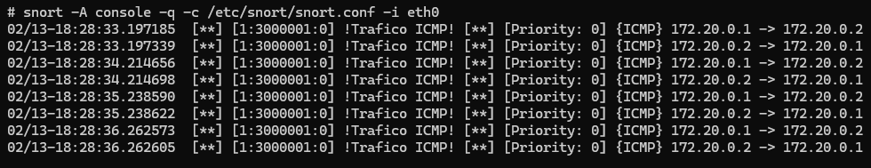

---

## Comprobación del ataque SSH (Hydra) y ajustes en Snort

### Contexto

Para validar el caso de uso de fuerza bruta SSH, seguimos el apartado del profesorado creando tres scripts: `crear_claves`, `crear_usuarios` y `lanzar_hydra`, con el objetivo de automatizar la preparación del entorno (usuarios/claves) y el lanzamiento del ataque con Hydra.

### 1) Preparación (scripts del profesorado)

Se ejecutaron los scripts en este orden lógico:

- `crear_claves`: generar/definir credenciales que se usarían en la simulación.
- `crear_usuarios`: crear los usuarios objetivo en el sistema (los que intentaría autenticarse Hydra).
- `lanzar_hydra`: ejecutar el ataque de fuerza bruta contra el servicio SSH del objetivo.

El criterio de validación era que Snort generase alertas y quedaran registradas en `/var/log/snort/alert` (para su posterior envío a ELK).

### 2) Problema inicial: no se registraban alertas como esperábamos

Aunque el ataque se estaba ejecutando, observamos que las reglas no se estaban registrando correctamente al lanzar Snort desde consola (recordamos que el comando inicial era "sin la `-k`").

Esto nos llevó a revisar dos aspectos:

- **Condición de la regla**: la regla solo detectaba cuando el tráfico cumplía `flow:established`.
- **Ejecución/captura**: había tráfico que no estaba entrando como "establecido" (o Snort no lo estaba considerando así), por lo que no disparaba.

Sobre `flow:to_server, established`: esta opción limita la regla a paquetes en dirección cliente→servidor y dentro de conexiones TCP ya establecidas.

### 3) Ajuste para corroborar: modificar la regla (quitar dependencia estricta de `flow:established`)

Para poder ver intentos y no solo sesiones "ya establecidas", modificamos la regla para que también saltara con intentos que no cumplieran estrictamente `flow:established` (con el objetivo de corroboración durante pruebas).

En la práctica, esto suele implicar:

- Quitar `established` del `flow`, o
- Cambiar la condición de flujo a algo menos restrictivo (p. ej. mantener `to_server` pero sin `established`), según el objetivo del laboratorio.

### 4) Solución definitiva: cambiar el comando de ejecución de Snort y ajustar la regla

Finalmente, cambiamos el comando de ejecución a:
```bash
snort -A fast -q -c /etc/snort/snort.conf -i eth0 -k none -l /var/log/snort
```

**Qué aporta cada opción (lo relevante para el problema):**

- `-A fast`: genera alertas en formato "fast" (una línea por alerta), ideal para escribir en fichero y que Filebeat lo lea.
- `-q`: modo "quiet", reduce salida por pantalla para que sea más limpio en ejecución.
- `-c /etc/snort/snort.conf`: carga la configuración principal.
- `-i eth0`: captura en la interfaz indicada.
- `-l /var/log/snort`: fuerza el directorio de logs/alertas.
- `-k none`: ignora comprobaciones de checksum, útil en pruebas cuando hay offloading/checksums "raros" que impiden que Snort considere correctamente ciertos paquetes (en laboratorios y algunos entornos virtualizados). **Ojo:** no es recomendable como ajuste permanente en producción porque puede abrir la puerta a evasiones.

Con este cambio (comando + regla ajustada), Snort empezó a registrar alertas de forma consistente en `/var/log/snort/alert`, y ya pudimos validar el flujo de detección.

### Evidencias de validación

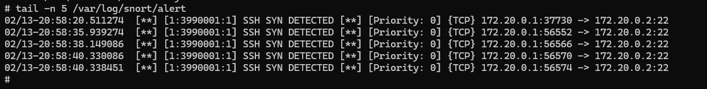
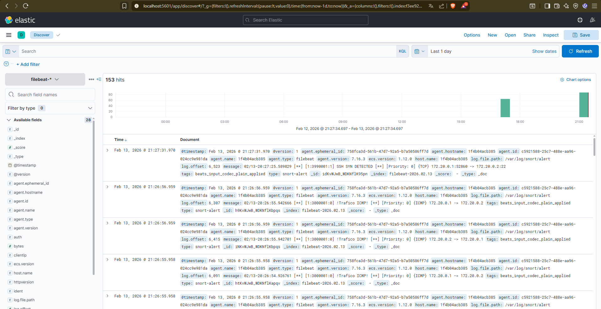

### 2) Ruta inexistente de reglas dinámicas: `/usr/local/lib/snort_dynamicrules`

**Síntoma:**

- `Could not stat dynamic module path "/usr/local/lib/snort_dynamicrules": No such file or directory.`

**Causa:**

- El `snort.conf` incluye por defecto la carga de reglas dinámicas, esperando que exista el directorio.

**Solución aplicada:**
```bash
mkdir -p /usr/local/lib/snort_dynamicrules
```

Tras crear el directorio, el test de configuración pudo continuar.

---

### 3) `local.rules` no se encontraba por un `RULE_PATH` relativo

**Síntoma:**

- `Unable to open rules file "/etc/snort/../rules/local.rules": No such file or directory.`

**Causa:**

- En `snort.conf` estaba definido:
```
  var RULE_PATH ../rules
```
  lo que hacía que Snort buscase reglas fuera del árbol `/etc/snort` (resolviendo a `/etc/rules`).

**Solución aplicada:**

- Se normalizó el `RULE_PATH` con una ruta absoluta y se creó la estructura esperada:
```
var RULE_PATH /etc/snort/rules
include $RULE_PATH/local.rules
```
```bash
mkdir -p /etc/snort/rules
touch /etc/snort/rules/local.rules
```

---

### 4) Intento de carga de reglas OpenAppID/AppID (`app-detect.rules`)

**Síntoma:**

- Error tipo: `Unable to open rules file ".../app-detect.rules": No such file or directory.`

**Causa:**

- El `snort.conf` incluía reglas AppID/OpenAppID, pero Snort se compiló con `--disable-open-appid` (para evitar LuaJIT), por lo que no se desplegó ese conjunto de reglas.

**Solución aplicada:**

- Se comentaron las líneas `include` y/o bloques de configuración relacionados con AppID/OpenAppID para que Snort no intentase cargar esos ficheros.

---

### 5) Faltaban reglas "por defecto" (ej. `attack-responses.rules`)

**Síntoma:**

- `Unable to open rules file ".../attack-responses.rules": No such file or directory.`

**Causa:**

- `snort.conf` referencia múltiples ficheros `.rules` de un ruleset completo, pero en la PoC únicamente se creó `local.rules` (no se instaló un ruleset completo en `/etc/snort/rules`).

**Solución aplicada (PoC):**

- Se dejaron activas únicamente las reglas locales (`local.rules`) y se comentaron los `include` de reglas no disponibles para poder validar la configuración.

---

## Resultado final: configuración validada correctamente

Tras ajustar rutas (`RULE_PATH`), crear directorios requeridos y desactivar includes no presentes (AppID y ruleset no instalado), Snort validó la configuración con éxito:

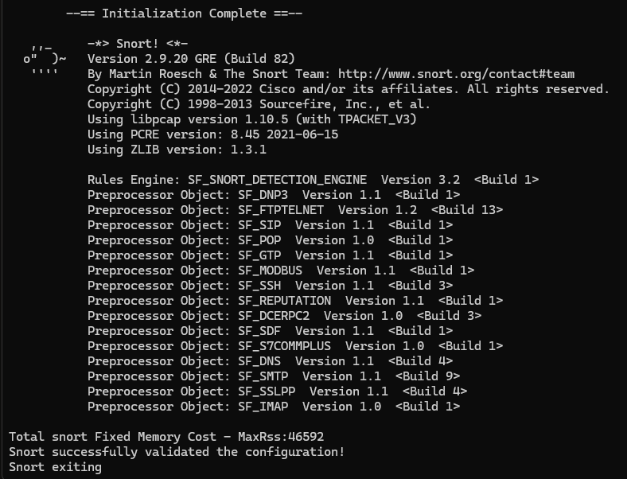

---

## Configuración de Filebeat para recolectar logs de Nginx y Snort

### 1) Logs a recolectar

En el contenedor agente, los ficheros de interés fueron:

- Nginx: `/var/log/nginx/*.log`
- Snort (alertas): `/var/log/snort/alert`

**Prerequisito importante:** Snort debe estar ejecutándose en modo que escriba las alertas al archivo de log. Para ello, se debe tener ejecutándose el siguiente comando:
```bash
snort -A fast -q -c /etc/snort/snort.conf -i eth0 -k none -l /var/log/snort
```

Donde:
- `-A fast` especifica el formato de alertas rápido (timestamp, mensaje, IPs, puertos)
- `-l /var/log/snort` indica el directorio donde se escribirán los logs de alertas

Esto asegura que todas las alertas detectadas por Snort se vayan almacenando en el archivo `/var/log/snort/alert`.

**Verificación rápida de que Snort está escribiendo:**
```bash
ls -lh /var/log/snort/alert
tail -n 5 /var/log/snort/alert
```

### 2) Configuración de Filebeat

#### Inputs (paths)

Añadimos un input para Snort (y mantuvimos el de Nginx) apuntando a los paths reales de los logs para que Filebeat "harvestee" líneas nuevas. (La clave es que Filebeat solo envía lo que esté definido en sus inputs).

Ejemplo de configuración:


#### Output (Logstash:5044)

Configuramos la salida para que Filebeat envíe a Logstash usando `output.logstash` y el host/puerto donde Logstash escucha Beats (típicamente 5044).
```yaml
output.logstash:
  hosts: ["elk:5044"]
```

### 3) Arranque correcto en contenedor

Detectamos que `service filebeat start` no dejaba Filebeat "vivo" (se quedaba como not running/failed), así que lo ejecutamos como proceso principal/foreground dentro del contenedor.

**Comandos de verificación:**
```bash
filebeat test config -e
filebeat test output -e
```

**Ejecución recomendada en contenedor:**
```bash
filebeat -e
```

Esto mantiene Filebeat ejecutándose y enviando eventos en tiempo real, en vez de "arrancar y morir" por no tener init/systemd dentro del contenedor.

- Imagen que prueba que manda las alertas de ICMP y SSH correctamente.


---
