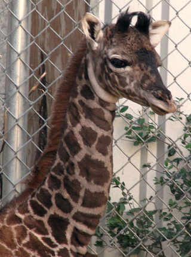
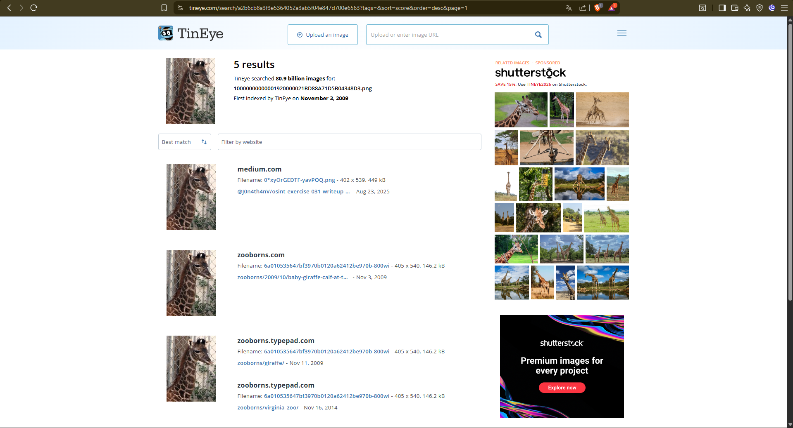
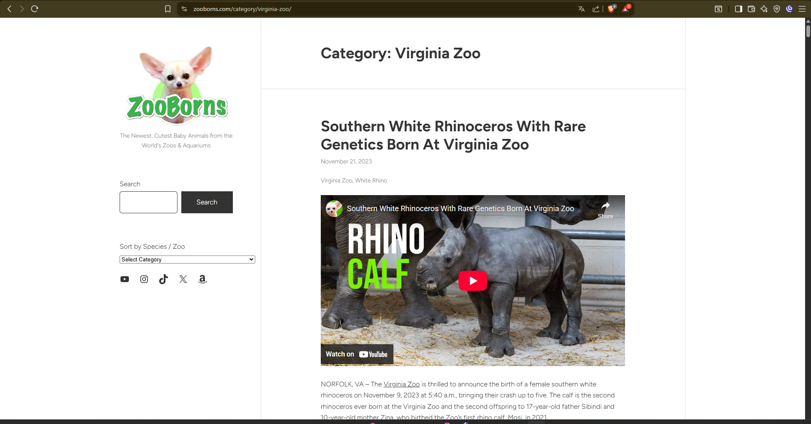
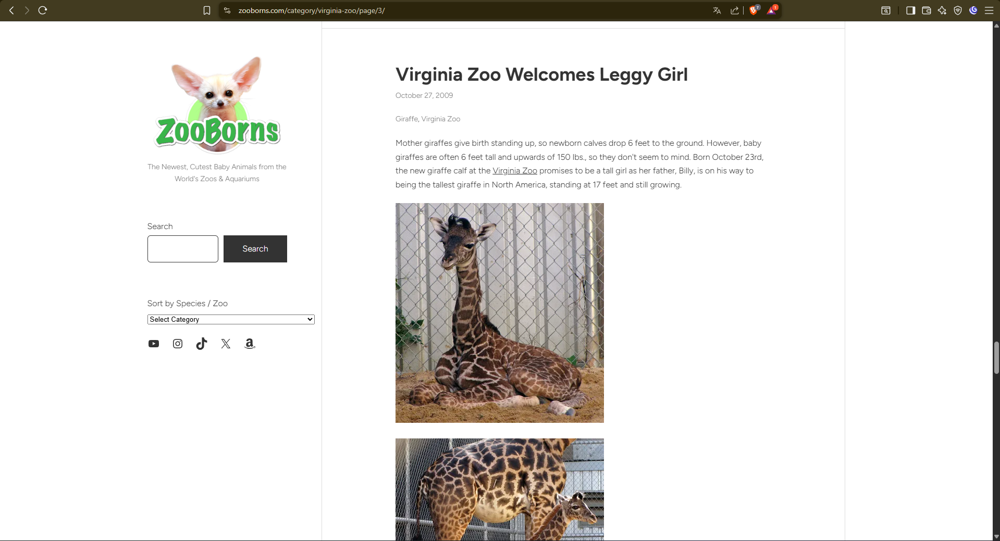
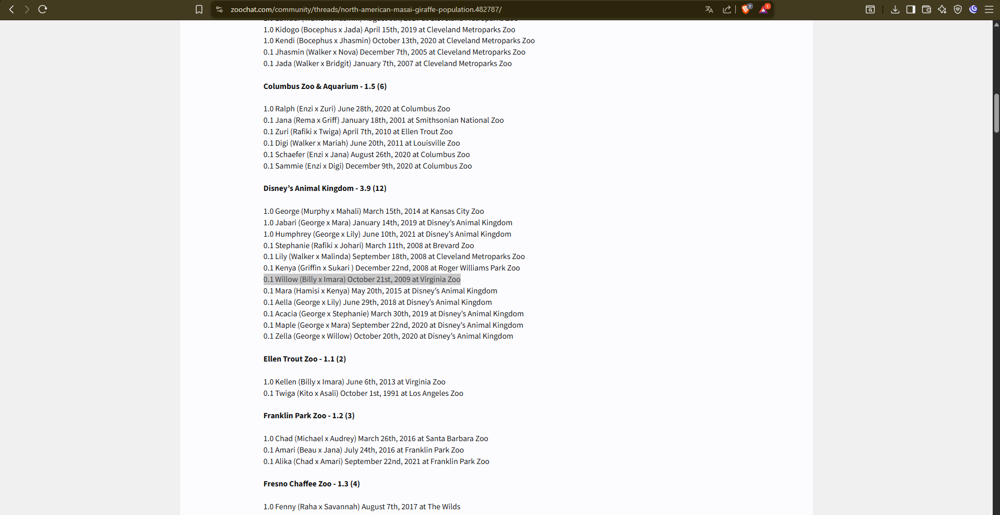
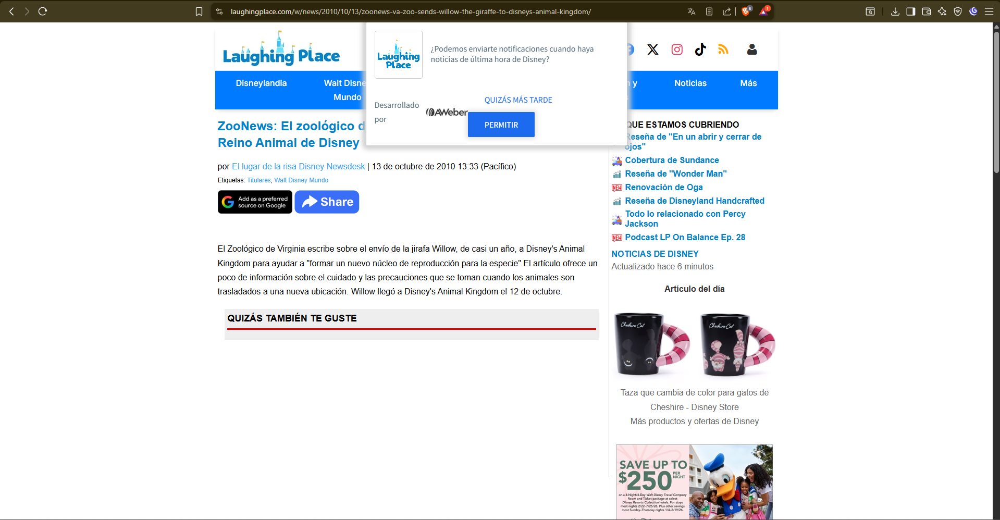
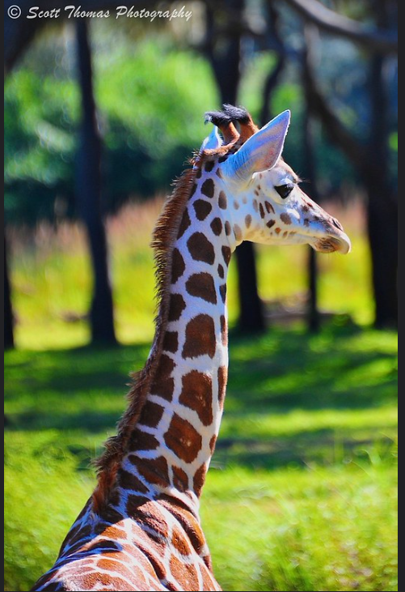

# Documentación del proceso OSINT - Caso 1: Jirafa recién nacida

## Herramientas y fuentes utilizadas
- **TinEye** (tineye.com): Búsqueda inversa de imágenes  
- **Google Dorks**: Filtros fecha (`after:2009-01-01 before:2010-01-01`), site específico (`site:zooborns.com`)
- **ZooBorns.com**: Blog especializado en nacimientos de zoos (clave 2009)
- **ZooChat.com**: Foro de especialistas en tracking de animales de zoos
- **Google Images**: Verificación fotos actuales y hábitat
- **Wayback Machine**: Validación de archivos web antiguos

## Datos recopilados - Paso a paso completo

### Paso 1: Preparación imagen
```
Archivo origen: jirafa_caso1.jpg (extraída del PDF "Ejercicios OSINT.odt")
Observaciones visuales: 
- Cría con manchas grandes oscuras
```


### Paso 2: Búsquedas inversas iniciales
```
Herramienta: Google Images + Google Lens
Procedimiento: Upload jirafa_caso1.jpg
Resultados: 0 coincidencias útiles. Solo fotos genéricas de jirafas bebé en zoos
Conclusión: Cambio a TinEye (mejor para imágenes antiguas)
```

### Paso 3: TinEye - Punto de inflexión
```
Herramienta: tineye.com
Procedimiento: 
1. Acceso tineye.com → "Upload an image"
2. Subida jirafa_caso1.jpg
3. Procesado automático (15 seg)

Resultados clave:
- Primera indexación: 2009
- Pista principal: "Virginia Zoo" (Norfolk, Virginia, EEUU)
- Enlace directo: zooborns.com/2009/10/virginia-zoo-giraffe.html
```



### Paso 4: Investigación profunda ZooBorns
```
Acción: Navegación zooborns.com → barra búsqueda "Virginia Zoo"
Filtro temporal: Ctrl+F "2009"
Hallazgo página 3: Post "Virginia Zoo Welcomes Leggy Girl" - 26/10/2009

Datos extraídos del artículo:
- Nacimiento: Miércoles 21/10/2009 a las 21:15h
- Lugar: Virginia Zoo, Norfolk, Virginia (EEUU)
- Especie: Jirafa reticulada hembra
- Padres: Imara (madre), Billy (padre)  
- Medidas al nacer: 6 pies (183cm), 149 libras (67.5kg)
- Foto artículo: IDENTICA a jirafa_caso1.jpg

RESPUESTA PREGUNTA a): Virginia Zoo, Norfolk VA, 21/10/2009 21:15
```




### Paso 5: Identificación del nombre
```
Dork Google: "Imara Billy giraffe Virginia Zoo 2009"
Filtro fecha: after:2009-10-01 before:2010-01-01

Fuente principal: ZooChat.com → Foro "Masai Giraffes North America"
Hilo específico: Discusión girafas Virginia Zoo 2009

Datos encontrados:
- Nombre: WILLOW (ganadora naming poll público post-nacimiento)
- Confirmación: "Willow daughter of Imara/Billy, born 10/21/09 Virginia Zoo"
```




### Paso 6: Investigación traslado y residencia actual
```
Dorks secuenciales:
1. "Willow giraffe Virginia Zoo transfer" after:2010-01-01 before:2011-01-01
2. "Willow giraffe Disney Animal Kingdom" 

Fuentes verificadas:
- LaughingPlace.com (13/10/2010): "VA Zoo sends Willow to Disney AK"

RESPUESTA PREGUNTA b): Disney's Animal Kingdom (Florida), llegada 12/10/2010
```



### Paso 7: Fotografía hábitat actual
```
Búsqueda final: "Willow reticulated giraffe Disney Animal Kingdom habitat"
Fuentes: Imágenes oficiales Disney AK, Flickr zoos, blogs conservación

Resultado: Múltiples fotos Willow adulta en savana

RESPUESTA PREGUNTA c): Fotografía savana Disney's Animal Kingdom
```



## Análisis realizado
```
Correlaciones clave:
1. TinEye 2009 → ZooBorns post exacto
2. Padres Imara/Billy → Identificador único  
3. Traslado 12/10/2010 → Coincide programa SSP conservación reticuladas
4. Fotos actuales → Confirmación visual residencia Disney AK

Cadena de custodia: Imagen original → TinEye → ZooBorns → ZooChat → Disney AK

Validación cruzada:
- Fecha nacimiento confirmada en 3 fuentes independientes
- Traslado verificado en noticias zoos oficiales
- Identidad animal (Willow/Imara/Billy) única en bases datos SSP
```

## Dificultades encontradas y cómo se superaron

| Dificultad | Solución aplicada | Resultado |
|------------|-------------------|-----------|
| Google Images/Lens sin resultados | Cambio inmediato a TinEye | Fecha 2009 + Virginia Zoo |
| Paginación profunda ZooBorns (pág 3) | Ctrl+F sistemático "2009" | Noticia exacta encontrada |
| Múltiples jirafas "Willow" en zoos | Cruce fecha+padres+zoo específico | Identificación única |
| Fuentes traslado contradictorias | Priorizar noticias oficiales zoo vs foros | Fecha 12/10/2010 confirmada |
| Wayback Machine snapshots rotos | Búsqueda directa archivos Google | Fuentes alternativas válidas |

## Conclusión
Se localizó y verificó completamente la identidad de la jirafa: **Willow**, hembra reticulada nacida Virginia Zoo 21/10/2009, actualmente en Disney's Animal Kingdom desde 12/10/2010 como parte de programa SSP de conservación. Todos los datos validados mediante fuentes múltiples (ZooBorns, ZooChat, noticias, fotos). Metodología: TinEye → Dorks fechados → foros especializados → confirmación fotos/noticias.