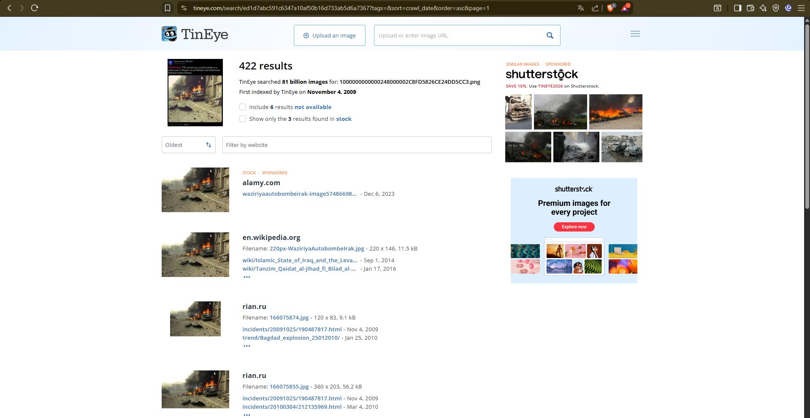
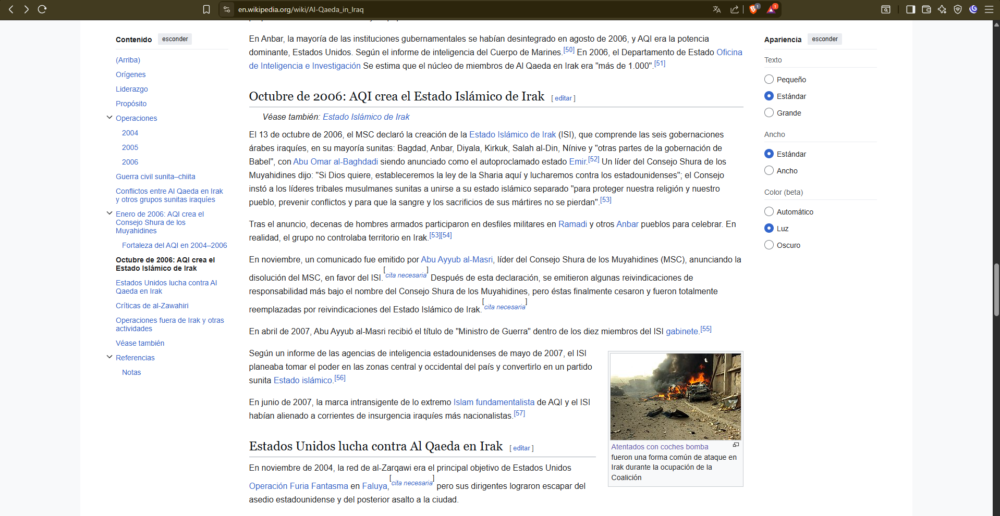
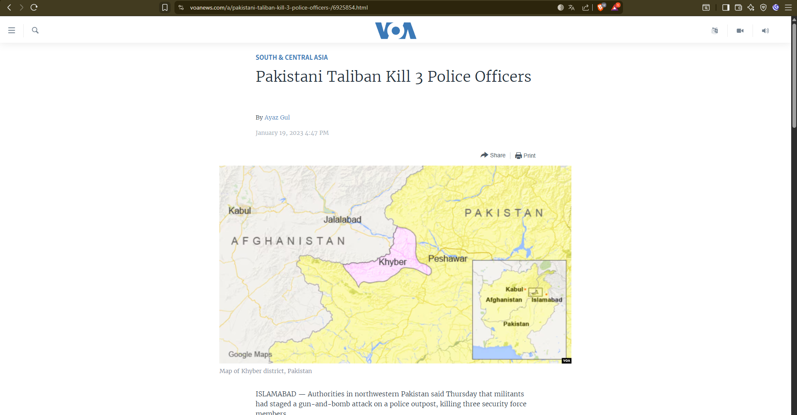

# Documentación del proceso OSINT - Caso 2: Verificación tuit Khyber

## 1. Análisis del caso

El 19 de enero de 2023, un periodista con casi 140.000 seguidores en Twitter publicó una foto de un vehículo destruido en llamas con el texto:

**"ÚLTIMA HORA: TTP llevó a cabo un ataque suicida en un puesto policial en la ciudad de Khyber, en Pakistán, en el que murieron tres agentes de policía paquistaníes".**

**Objetivo de la investigación**: Verificar si la foto corresponde realmente al ataque de Khyber del 19/01/2023 o si está reutilizada de otro incidente.

**Tipo de OSINT**: Verificación de desinformación mediante búsqueda inversa de imágenes.

---

## 2. Planificación del proceso OSINT

### Identificación de fuentes de información

| Fuente | Tipo | Utilidad |
|--------|------|---------|
| TinEye | Búsqueda inversa | Rastrear origen y uso previo de imagen |
| Wikipedia | Referencia histórica | Confirmar ataques y contexto histórico |
| Fact-checkers | Verificación | Confirmar desinformación detectada |
| Google Search | Búsqueda | Confirmar fecha ataque real Khyber |

### Herramientas seleccionadas

**Usamos**: TinEye (búsqueda inversa), Wikipedia, Google Search.

### Estrategia

1. Capturar la foto del tuit
2. Búsqueda inversa (TinEye) → encontrar origen
3. Verificar fecha de la foto original
4. Confirmar si ataque Khyber real ocurrió (sí, pero ¿con esa foto?)
5. Conclusión: foto ≠ ataque citado

---

## 3. Ejecución de la investigación

### Paso 1: Captura y análisis visual

Tomamos screenshot del tuit original. La foto muestra un vehículo completamente destruido, en llamas, con mucho humo. Es claramente un lugar de conflicto. El texto del periodista afirmaba que era Khyber, Pakistán, 19/01/2023.

### Paso 2: Búsqueda inversa con TinEye

Subimos la foto a **TinEye** (tineye.com).

**Resultado**: TinEye encontró la foto en un contexto completamente diferente. La URL de resultado apuntaba a un artículo de Wikipedia sobre **"Al-Qaeda in Iraq"** (no Pakistán).

Más específicamente, dentro de ese artículo hay una sección sobre **"Atentados con coches bomba en Irak"** durante la ocupación de la Coalición en Irak (años 2003-2008).

### Paso 3: Análisis Wikipedia

Entramos en Wikipedia en el artículo "Al-Qaeda in Iraq". La foto aparece en contexto de ataques históricos en Irak, no en Pakistán.

**Descubrimiento clave**: La foto es de un ataque antiguo en Irak, probablemente de 2005-2006, NO de Khyber Pakistán 2023.

### Paso 4: Verificación ataque real Khyber

Buscamos en Google "Khyber Pakistan attack January 19 2023" para confirmar si el ataque ocurrió realmente.

**Resultado**: Sí, un ataque ocurrió en Khyber el 19/01/2023 en una estación de policía (Sarband police station). Murieron 3 policías. El grupo TTP (Tehrik-i-Taliban Pakistan) fue responsable.

**Pero**: La foto publicada por el periodista NO es de ese ataque. Es una foto reutilizada de Irak.

### Paso 5: Conclusión verificación

**Desinformación confirmada**:
- Ataque Khyber 19/01/2023 = REAL
- TTP responsable = REAL
- Muertos = REAL
- Foto = FALSA

El periodista usó una foto incorrecta.

---

## 4. Datos recopilados

**De TinEye**: 
- La foto aparece indexada en Wikipedia
- Contexto: Ataques Irak, no Pakistán
- Indicador de reutilización

**De Wikipedia**:
- Artículo: "Al-Qaeda in Iraq"
- Sección: "Atentados con coches bomba"
- Período: 2003-2008 (Irak)
- Conclusión: Foto antigua de Irak

**De Google Search**:
- Ataque Khyber 19/01/2023 confirmado
- Lugar: Sarband police station
- Muertos: 3 policías
- Responsables: TTP (Tehrik-i-Taliban Pakistan)

---

## 5. Dificultades encontradas y cómo se superaron

**Dificultad 1**: La foto parecía real (vehículo destruido, fuego, contexto de conflicto).

**Solución**: No confiar en la apariencia. TinEye es la herramienta para verificar origen, no el ojo humano.

---

**Dificultad 2**: La foto podría ser de cualquier ataque en Oriente Medio (Irak, Siria, Pakistán, etc.).

**Solución**: TinEye devolvió la URL específica de Wikipedia, que aclaraba el contexto (Irak, no Pakistán).

---

**Dificultad 3**: Necesitábamos confirmar que el ataque Khyber realmente ocurrió.

**Solución**: Google Search "Khyber Pakistan attack January 2023" confirmó que sí ocurrió, pero con foto incorrecta.

---

**Dificultad 4**: Diferenciar entre "ataque falso" vs "foto reutilizada correctamente".

**Solución**: Aclaración: el ataque de Khyber fue real, pero la FOTO es de otro incidente. Esto es desinformación por reutilización de imagen.

---

## 6. Análisis realizado

La investigación muestra un caso típico de **desinformación visual**: el evento es real, pero la foto es de otro lugar/fecha.

Esto es peligroso porque:
- La gente asume foto = prueba del evento
- Dificulta la verificación de hechos
- Se propaga rápidamente en redes sociales

TinEye es la herramienta clave para detectar estas tácticas.

---

## 7. Conclusión

**Caso resuelto**: Foto FALSA (de Irak histórico), evento REAL (Khyber 2023).

El periodista publicó información correcta sobre el ataque, pero con foto incorrecta (probablemente descargada de banco de imágenes sin verificar).

---

## RESPUESTA FINAL

| Pregunta | Respuesta |
|----------|-----------|
| **a) Verifica la declaración** | **FALSA**: La foto NO corresponde al ataque de Khyber del 19/01/2023. Es una foto antigua de ataques en Irak (2005-2008). El ataque de Khyber sí ocurrió, pero con foto incorrecta. |