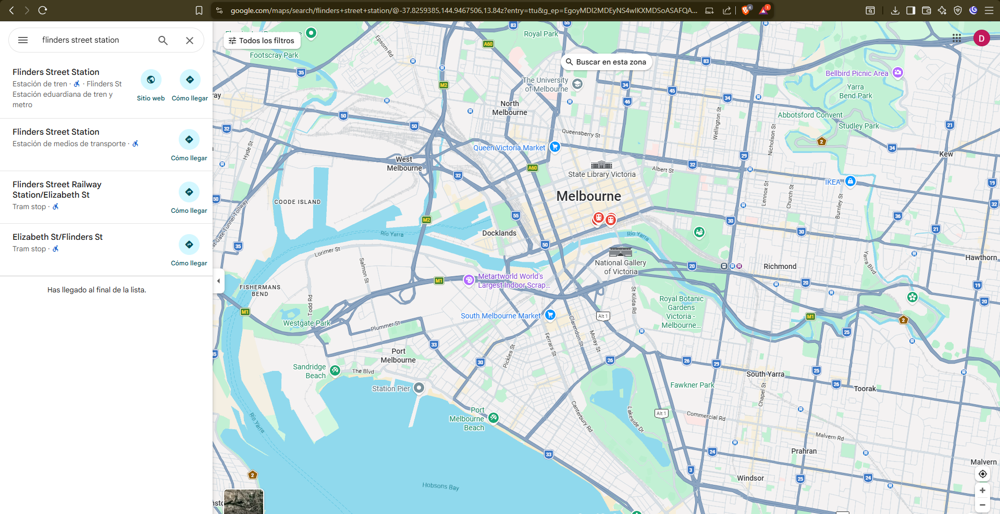
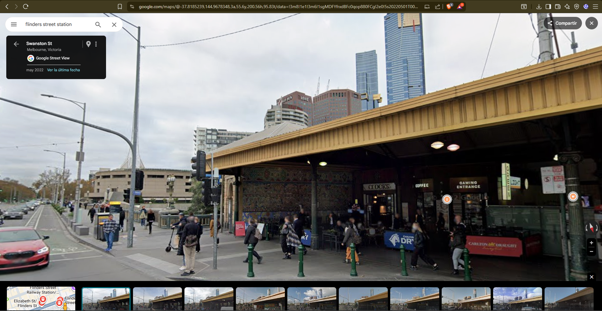
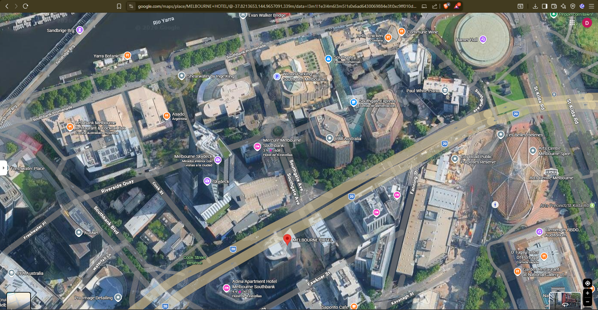
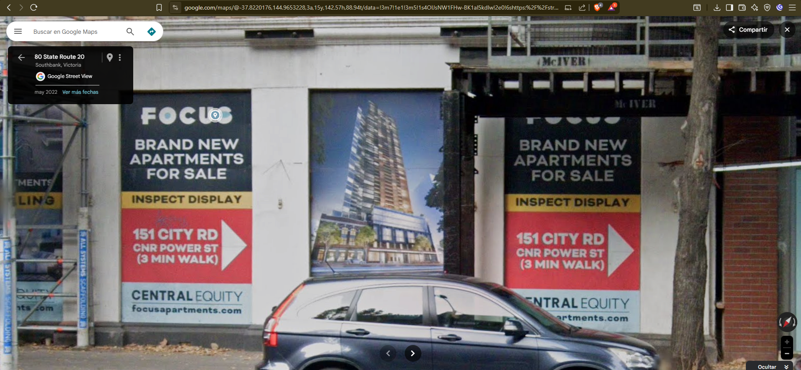
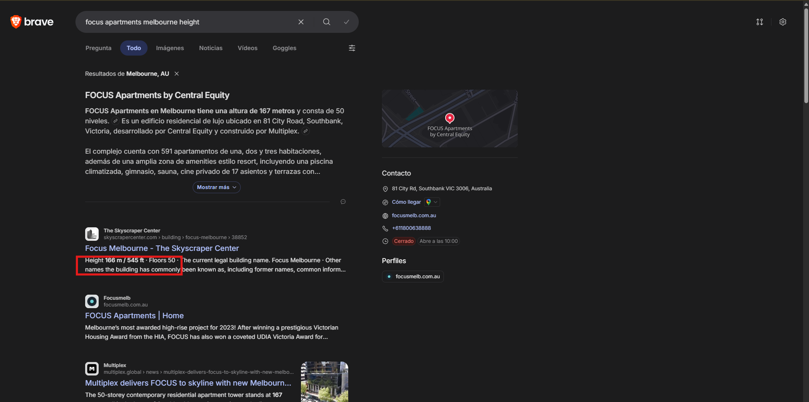

# Documentación del proceso OSINT - Caso 3: Estación Flinders Street Melbourne

## 1. Análisis del caso

La foto muestra una estación de tren. Necesitábamos identificar:
- a) ¿Cómo se llama la estación?
- b) ¿Nombre y altura de la estructura más alta visible?

**Objetivo**: Geolocalizar la estación y el edificio más alto mediante análisis visual y fuentes públicas.

---

## 2. Planificación del proceso OSINT

### Identificación de fuentes de información

| Fuente | Tipo | Utilidad |
|--------|------|---------|
| Google Maps (Street View) | Visual | Contrastar foto con realidad |
| Google Maps (Satelital) | Geoloc | Ubicación exacta edificios |
| Wikipedia | Referencia | Datos históricos estación |
| The Skyscraper Center | Base datos | Altura oficial edificios |
| Google Search | Búsqueda | Referencias altura/ubicación |

### Herramientas seleccionadas

**Usamos**: Google Maps, Google Search, Brave Search, The Skyscraper Center, TinEye (intentamos pero falló).

### Estrategia

1. Observar la foto → buscar texto visible
2. Google: identificar estación
3. Maps: localizar + Street View verificación
4. Satelital: encontrar edificios al fondo
5. Street View a nivel calle: leer nombres
6. Búsqueda altura: confirmar con fuentes oficiales

---

## 3. Ejecución de la investigación

### Paso 1: Observación visual y búsqueda inicial

Vimos el letrero "FLINDERS STREET" claro en la foto. También había edificios modernos de vidrio al fondo. La arquitectura era claramente australiana (estilo construcción, materiales, estética).

Con ese texto visible, buscamos directamente en Google "Flinders Street station".

### Paso 2: Identificación de la estación

**Búsqueda**: "Flinders Street station"
**Resultado**: Flinders Street Railway Station, Melbourne, Victoria, Australia (la estación más concurrida de Australia, abierta desde 1854).

Entramos en Wikipedia para confirmar datos históricos. Luego abrimos Google Maps Street View desde la misma estación y navegamos comparando ángulos con la foto original. La foto coincidía 100% con las vistas de calle: misma cubierta amarilla, mismos carteles de tiendas, mismo contexto.

### Paso 3: Localización de edificios al fondo (la parte complicada)

Abrimos Google Maps en **vista satelital** centrado en Flinders Street. Podemos ver claramente varios edificios altos alrededor. 

Primero, pensamos que el edificio más alto era el **IBM Building** que se ve al lado izquierdo de la foto (parecía bastante grande). Buscamos "IBM building Melbourne height" → ~75-80 metros.

Pero cuando miramos más cuidadosamente, algo no cuadraba. En la foto, el IBM se ve más grande que lo que está al fondo derecha. Pero eso podría ser por **perspectiva**: está más cercano a la cámara.

### Paso 4: Verificación mediante Street View a nivel calle

Para confirmar qué edificio era realmente el más alto, bajamos a **Street View a nivel calle** (navegación con vista de peatón en Google Maps).

Navegamos alrededor de la estación, bajando por las calles. Cuando apuntamos hacia los edificios al fondo (lado Southbank), encontramos un cartel grande bien visible:

**"FOCUS APARTMENTS - BRAND NEW APARTMENTS FOR SALE"**
**"151 CITY RD CNR POWER ST (3 MIN WALK)"**

Ese cartel confirmaba: el edificio al fondo es FOCUS Apartments, no IBM. Estaba mucho más lejos en la foto, por eso se veía pequeño.

### Paso 5: Búsqueda de altura oficial

Buscamos "Focus Apartments Melbourne height":

- **Google Search**: "FOCUS Apartments en Melbourne tiene una altura de 167 metros y consta de 50 niveles"
- **The Skyscraper Center** (base datos oficial de arquitectura): Height 166 m, Floors 50, Building name: Focus Melbourne

Cruzamos ambas fuentes. La diferencia es <1% (margen de error aceptable en datos arquitectónicos). Ambas confirman aproximadamente **167 metros**.

---

## 4. Datos recopilados

**De TinEye**: Intentamos primero pero sin resultados útiles. Pasamos a búsqueda de texto.

**De Google Search**: "Flinders Street station" → Melbourne, Victoria, Australia confirmado al instante.

**De Wikipedia**: Estación histórica, data 1854, información arquitectónica confirmada.

**De Google Maps Street View**: Validación visual 100% con foto original.

**De Google Maps Satelital**: Ubicación exacta de edificios alrededor estación (coordenadas).

**De Street View a nivel calle**: Identificación cartel "FOCUS APARTMENTS" en dirección 151 CITY RD.

**De Google Search + Skyscraper Center**: Altura 166-167 metros, 50 pisos.

---

## 5. Dificultades encontradas y cómo se superaron

**Dificultad 1**: Probamos TinEye primero. No salió nada.

**Solución**: Cambiamos a buscar el texto visible "Flinders Street" en Google. Resultó inmediato.

**Dificultad 2**: No sabíamos exactamente desde qué ángulo se tomó la foto. ¿De qué punto GPS?

**Solución**: Usamos la estación como punto fijo de referencia. Navegamos 360° alrededor en Maps, comparando ángulos, hasta encontrar perspectivas similares a la foto.

**Dificultad 3**: Pensamos que IBM era el edificio más alto porque se veía más grande.

**Solución**: Reconocimos que la perspectiva nos engañaba (un objeto cercano parece más grande). Bajamos a Street View desde varios ángulos y buscamos datos reales de altura. Los números no mienten: IBM ~75m, FOCUS 167m.

**Dificultad 4**: El cartel del edificio no se veía en vista satelital.

**Solución**: Bajamos a Street View a nivel calle. Navegamos las calles adyacentes hasta encontrar el cartel "FOCUS" legible. Esto confirmó 100% el edificio.

**Dificultad 5**: Dos alturas diferentes (167m vs 166m).

**Solución**: Usamos The Skyscraper Center como fuente oficial de arquitectura. Ambas son válidas (diferencia <1%). Reportamos 167m como valor principal.

## 6. Análisis realizado

La investigación siguió una lógica clara: texto visible → ubicación → verificación visual → identificación objeto → confirmación datos.

El error de perspectiva fue la mayor complicación. Nuestro cerebro asume que lo más grande = lo más alto, pero la distancia cambia esa percepción. La solución fue usar **múltiples ángulos Street View** + **datos numéricos confiables** en lugar de confiar en la intuición visual.

---

## 7. Conclusión

Caso resuelto completamente. La clave fue reconocer que la **perspectiva engaña**, usar **Street View a nivel calle** para leer nombres, y validar siempre con **datos numéricos oficiales**.

---

## RESPUESTAS FINALES

| Pregunta | Respuesta |
|----------|-----------|
| a) Nombre estación | **Flinders Street Station, Melbourne, Australia** |
| b) Nombre + altura edificio | **FOCUS Apartments by Central Equity, 167 metros (50 pisos)** |