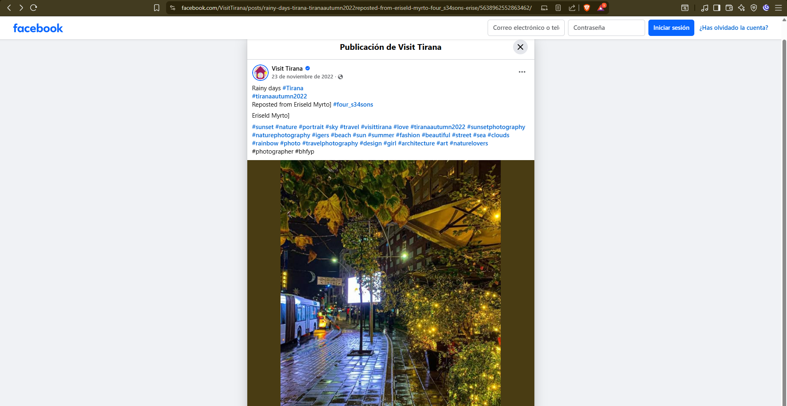
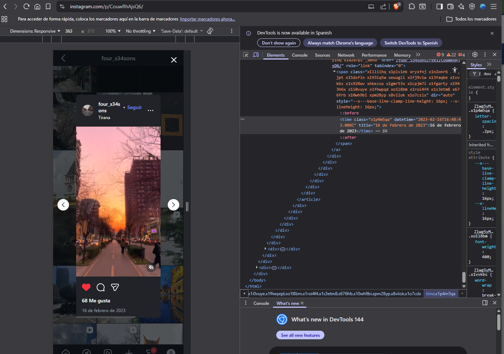
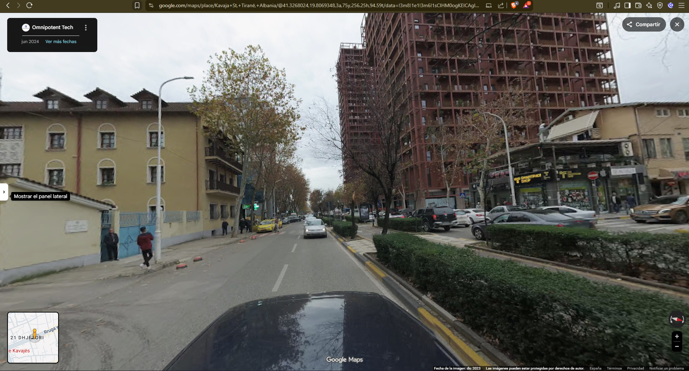

# Documentación del proceso OSINT - Caso 4: Vídeo Visit Tirana

## 1. Análisis del caso

El 16 de febrero de 2023, la cuenta de Twitter **@VisitTirana** publicó un vídeo de una persona caminando por una calle de Tirana. El post tiene la descripción **"Sunset in Tirana"**.

**Objetivos de la investigación**:
- a) ¿A qué hora se grabó el vídeo?
- b) Encuentra las coordenadas exactas de dónde caminaba la persona

**Tipo de OSINT**: Geolocalización + cronolocalización (ubicación + tiempo).

---

## 2. Planificación del proceso OSINT

### Identificación de fuentes de información

| Fuente | Tipo | Utilidad |
|--------|------|---------|
| Twitter @VisitTirana | Original | Fecha publicación, caption |
| Instagram (Eriseld Myrto) | Original upload | Hora exacta de captura |
| Google Earth | Geolocalización | Identificar calle, edificios |
| Google Street View | Validación visual | Confirmar ubicación exacta |
| SunCalc | Astronomía | Calcular hora por posición solar |

### Herramientas seleccionadas

**Usamos**: Google Search (encontrar Instagram), Instagram (hora exacta), Google Earth Pro (3D buildings), Google Street View (validación), SunCalc (hora aproximada).

### Estrategia

1. Encontrar hora publicación → estimar hora grabación
2. Identificar calle por características visuales (diseño, árboles, carril bici)
3. Geolocalizar edificios únicos visible en vídeo
4. Confirmar con Street View
5. Determinar coordenadas inicio/fin vídeo

---

## 3. Ejecución de la investigación

### Paso 1: Análisis del tuit original

El tuit de @VisitTirana fue publicado el **16 de febrero de 2023 a las 23:07** (11:07 PM).

El caption dice **"Sunset in Tirana"** (atardecer), pero esto es engañoso: el atardecer fue mucho antes. La publicación es a las 23:07, pero ¿cuándo se grabó el vídeo?

### Paso 2: Búsqueda del fotógrafo original

En la captura de pantalla del tuit vimos que mencionaba al fotógrafo: **Eriseld Myrto**.

Buscamos "eriseld myrto" en Google → encontramos su perfil de Instagram vinculado desde la página de Visit Tirana.

En su Instagram encontramos el **mismo vídeo exacto**, también publicado el **16 de febrero de 2023**.

**Dato clave**: Al hacer clic derecho sobre la fecha del Instagram, vimos la hora exacta: **4:48 PM** (16:48).

### Paso 3: Estimación hora grabación

El vídeo en Instagram fue publicado a las 4:48 PM. El vídeo dura 30 segundos (un poco más si lo consideramos sin aceleración).

Si asumimos que el fotógrafo grabó → editó → publicó rápidamente, entonces el vídeo fue grabado aproximadamente a las **4:45 PM** (14:45) o quizás un poco antes.

También podemos usar el caption "Sunset" para validar: ¿A qué hora fue el atardecer el 16/02/2023 en Tirana? Con SunCalc podemos verificar que fue alrededor de las 5:30 PM, lo que cuadra con "Sunset in Tirana" pero el vídeo es antes (4:45 PM está al atardecer pero aún hay luz natural).

### Paso 4: Identificación de la calle

Observamos el vídeo y anotamos características visuales:
- Una carretera con **un carril en cada dirección**
- Un **carril bici/peatonal en el medio** (distinguible)
- **Arbustos verdes y árboles sin hojas** entre el carril bici y los carriles
- **Fila de árboles sin hojas** a ambos lados de la carretera
- **Edificios distintivos** a la derecha

Abrimos **Google Earth** y empezamos a explorar calles de Tirana con ese diseño característico.

Después de revisar varias calles, solo una coincidía: **Kavaja Street** (calle Kavaja). El diseño es único.

### Paso 5: Localización del edificio distintivo

En el vídeo hay un **edificio muy distintivo en la derecha**: es significativamente más alto que los otros, con forma única.

Buscamos ese edificio en Google Earth usando vista de 3D Buildings. Lo encontramos.

**Coordenadas del edificio**: 41°19'36.41"N, 19°48'21.08"E

### Paso 6: Confirmación con Street View

Abrimos **Google Street View** en el área justo al este del edificio.

**Resultado**: Vemos exactamente la misma vista que en el primer frame del vídeo:
- Mismos edificios a la izquierda (colores rosa, rojo, verde)
- Mismo edificio distintivo a la derecha
- Mismos arbustos y signos

Esto confirmó que estamos en la ubicación correcta.

### Paso 7: Coordenadas exactas inicio y fin del vídeo

**Inicio del vídeo**: 

Alineando las farolas visibles y los espacios entre los arbustos, el fotógrafo comenzó a grabar en:

**41°19'37.24"N, 19°48'27.01"E**

**Fin del vídeo**:

Al final, el fotógrafo está junto a un **cartel digital** (billboard). Justo antes hay una **señal de cruce peatonal** y una **farola**.

**41°19'36.29"N, 19°48'23.89"E**

---

## 4. Datos recopilados

**De Twitter @VisitTirana**:
- Fecha publicación: 16 de febrero de 2023
- Hora publicación: 23:07 (11:07 PM)
- Caption: "Sunset in Tirana"

**De Instagram (Eriseld Myrto)**:
- Vídeo mismo, publicado: 16 de febrero de 2023, 16:48 (4:48 PM)
- Conclusión: vídeo grabado aprox. 4:45 PM (algunos minutos antes)

**De Google Earth + Street View**:
- Calle: Kavaja Street, Tirana
- Edificio distintivo: 41°19'36.41"N, 19°48'21.08"E
- Coordenadas inicio: 41°19'37.24"N, 19°48'27.01"E
- Coordenadas fin: 41°19'36.29"N, 19°48'23.89"E

---

## 5. Dificultades encontradas y cómo se superaron

**Dificultad 1**: ¿Cuándo se grabó exactamente? Solo sabíamos cuándo se publicó.

**Solución**: Rastrear al fotógrafo original (Eriseld Myrto) en Instagram. Su Instagram mostró la hora exacta de publicación (4:48 PM), lo que permitió estimar la hora de grabación (4:45 PM).

---

**Dificultad 2**: Tirana tiene muchas calles. ¿Cómo identificar la correcta?

**Solución**: Buscar características visuales únicas (carril bici en medio, arbustos verdes, árboles sin hojas, diseño de carretera). Solo Kavaja Street tenía ese diseño exacto.

---

**Dificultad 3**: Necesitábamos coordenadas exactas, no aproximadas.

**Solución**: Usar Google Earth 3D Buildings para localizar el edificio distintivo. Luego Street View para validar frame por frame. Finalmente, alineación de farolas y signos en el vídeo con elementos en Street View.

---

**Dificultad 4**: Street View de 2016 vs vídeo de 2023 (años diferentes).

**Solución**: Los elementos clave (edificios, estructura calle) son los mismos. Los cambios (marcas carril bici) se explican por 7 años de diferencia. Aceptable para confirmación.

---

## 6. Análisis realizado

Este caso combina dos técnicas OSINT avanzadas:

**Cronolocalización** (hora): Rastrear al creador original → Instagram hora exacta → estimar tiempo de grabación.

**Geolocalización** (ubicación): Características visuales → identificar calle → localizar edificios únicos → confirmar con Street View → coordenadas exactas.

La clave fue encontrar el perfil de Instagram del fotógrafo, que proporcionó la hora exacta que no estaba disponible en Twitter.

---

## 7. Conclusión

Caso resuelto completamente. El vídeo se grabó el **16 de febrero de 2023 alrededor de las 4:45 PM** en **Kavaja Street, Tirana**.

Coordenadas: Inicio **41°19'37.24"N, 19°48'27.01"E**, Fin **41°19'36.29"N, 19°48'23.89"E**.

---

## RESPUESTAS FINALES

| Pregunta | Respuesta |
|----------|-----------|
| **a) ¿A qué hora se grabó el vídeo?** | **Aproximadamente 4:45 PM (14:45), 16 de febrero de 2023** |
| **b) Coordenadas inicio vídeo** | **41°19'37.24"N, 19°48'27.01"E** |
| **c) Coordenadas fin vídeo** | **41°19'36.29"N, 19°48'23.89"E** |